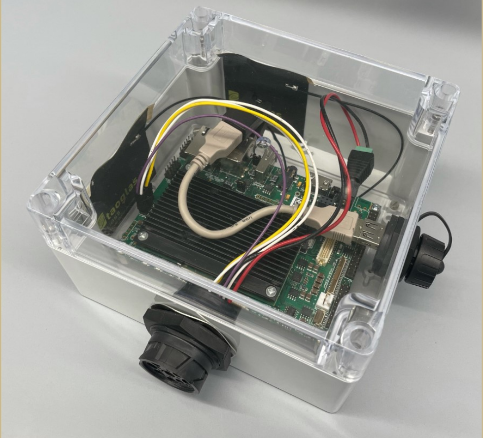
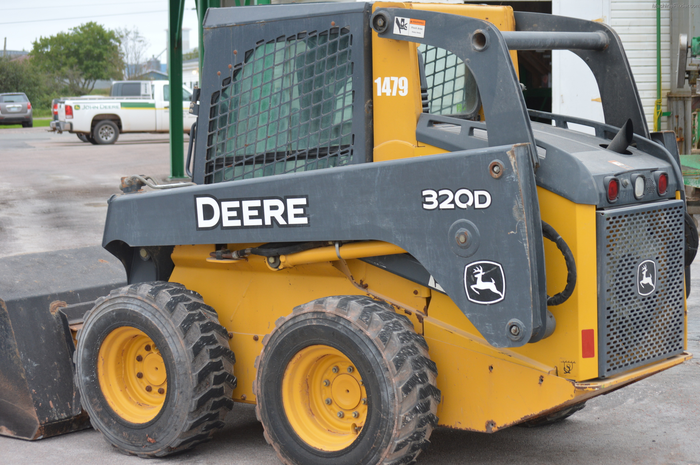

# REEU-23-06-30 CAN BUS J1939 Data Workshop

Welcome to the CAN BUS Data workshop of Dr. Krogmeier's REEU session. The data in use
was collected from a John Deere 320D Skid-steer machine during the ASM345 Spring 2022 
CAN BUS session using the ISOBlue edge-computer and the Avena software stack.

 

The ISOBlue edge-computer used in the data collection session of ASM345.

A John Deere (JD) 320D Skid-steer machine used as unit under test (UUT) during the class.

All data wrangling and processing will be done in Python, using Jupyter as coding environment. 
Please download the notebook (https://github.com/facastiblancor/REEU-23-06-30/blob/main/pandasCANExerciseBook.ipynb) and refer to the information on it to get started.

